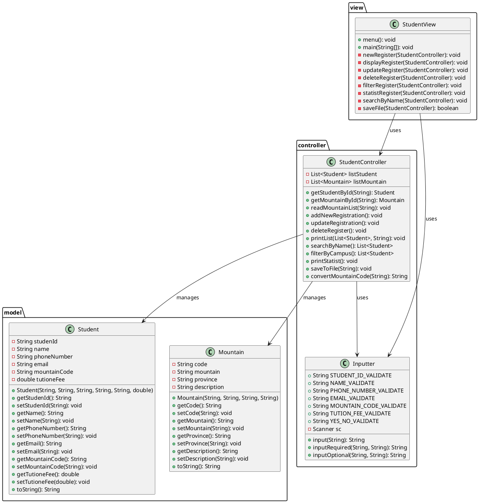
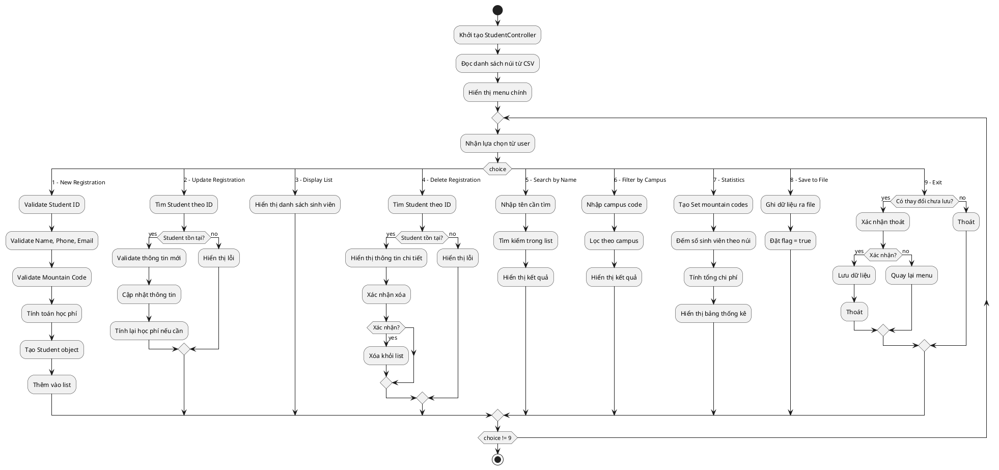

# Lab 02: Báo cáo chương trình quản lý đăng ký leo núi

## I. Decomposition

### 1.1 Phân chia theo kiến trúc MVC:
- **Model**: `Student.java`, `Mountain.java` - đại diện cho dữ liệu
- **View**: `StudentView.java` - giao diện người dùng và menu
- **Controller**: `StudentController.java`, `Inputter.java` - xử lý logic nghiệp vụ

### 1.2 Phân chia theo chức năng:
- **Quản lý sinh viên**: Thêm, sửa, xóa, tìm kiếm thông tin sinh viên
- **Quản lý núi**: Đọc danh sách núi từ file CSV
- **Xử lý dữ liệu**: Validation, tính toán học phí, thống kê
- **Lưu trữ**: Đọc/ghi file dữ liệu

### 1.3 Phân chia theo luồng xử lý:
- **Khởi tạo**: Load dữ liệu núi từ CSV
- **Tương tác**: Menu-driven interface
- **Xử lý**: Validation và business logic
- **Lưu trữ**: Ghi dữ liệu ra file

## II. Pattern Recognition

### 2.1 MVC Pattern:
- Tách biệt rõ ràng giữa Model (dữ liệu), View (giao diện), Controller (logic)
- `Student` và `Mountain` là Model classes
- `StudentView` là View class xử lý hiển thị
- `StudentController` là Controller xử lý business logic

### 2.2 Validation Pattern:
- Sử dụng regex patterns trong `Inputter` class
- Tách biệt validation rules thành constants
- Có 2 loại input: required và optional

### 2.3 Data Access Pattern:
- CRUD operations cho Student entity
- File I/O operations cho persistence
- Search và filter operations

## III. Abstraction

### 3.1 Entity Abstraction:
- `Student` entity: Đại diện cho thông tin sinh viên đăng ký leo núi
- `Mountain` entity: Đại diện cho thông tin các ngọn núi có thể leo

### 3.2 Service Abstraction:
- `StudentController`: Service layer xử lý tất cả business logic
- `Inputter`: Utility class xử lý input validation

### 3.3 Data Abstraction:
- Sử dụng List để quản lý collections
- File I/O abstraction cho persistence
- Menu-driven interface abstraction

## IV. Algorithm Design

### 4.1 Thuật toán chính - Main Menu Loop:
```
1. Hiển thị menu
2. Nhận input từ user
3. Switch case xử lý từng chức năng
4. Lặp lại cho đến khi user chọn exit
```

### 4.2 Thuật toán thêm sinh viên mới:
```
1. Validate student ID (không trùng)
2. Validate các thông tin khác (name, phone, email)
3. Validate mountain code (phải tồn tại)
4. Tính toán học phí (giảm 35% nếu phone đặc biệt)
5. Tạo Student object và thêm vào list
```

### 4.3 Thuật toán tìm kiếm:
```
1. Linear search qua list Student
2. So sánh điều kiện tìm kiếm
3. Thêm vào result list nếu match
4. Trả về result list
```

### 4.4 Thuật toán thống kê:
```
1. Tạo Set chứa các mountain code unique
2. Với mỗi mountain code:
   - Đếm số sinh viên
   - Tính tổng chi phí
3. Hiển thị kết quả dạng bảng
```

## V. Class Diagram



## VI. Flowchart



---

**Ghi chú**: 
- Chương trình sử dụng kiến trúc MVC để tách biệt rõ ràng các thành phần
- Validation được thực hiện thông qua regex patterns
- Dữ liệu được lưu trữ trong memory và có thể export ra file
- Giao diện menu-driven đơn giản và dễ sử dụng

