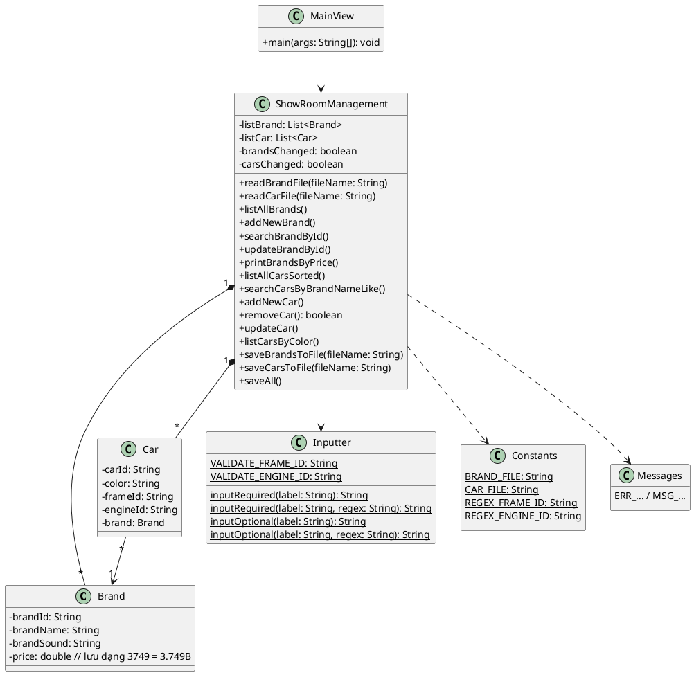
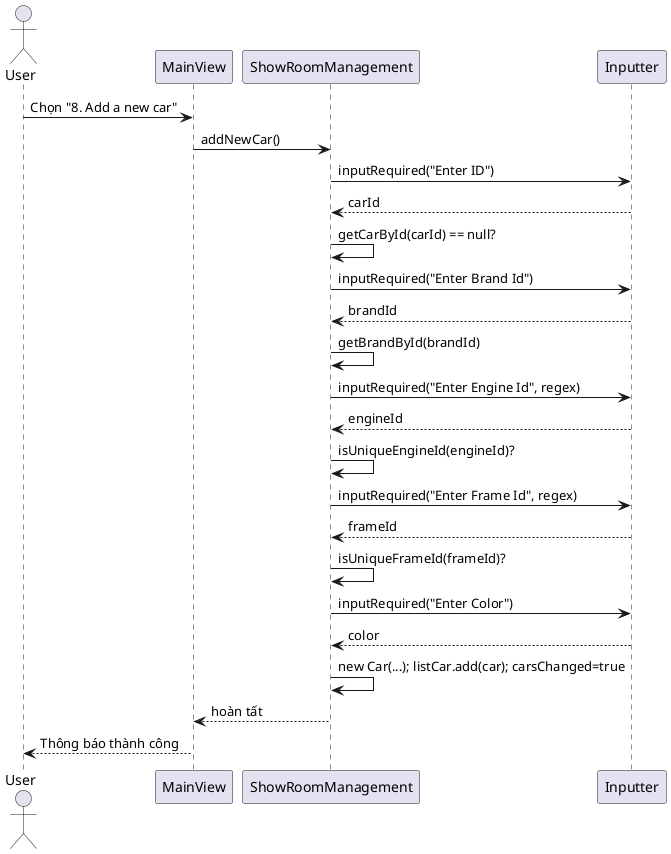
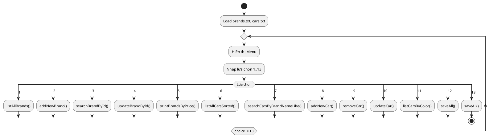

Michael BMW Showroom Management (J1.L.P0032)

Mô tả
- Ứng dụng console quản lý showroom xe BMW, đọc/ghi dữ liệu từ `brands.txt` và `cars.txt`. Áp dụng OOP, validate dữ liệu theo đề bài.

Kiến trúc
- `model/Brand.java`, `model/Car.java`: mô hình dữ liệu.
- `controller/ShowRoomManagement.java`: nghiệp vụ quản lý brand/car, đọc/ghi file.
- `controller/Inputter.java`: tiện ích nhập liệu và validate regex.
- `common/Constants.java`, `common/Messages.java`: hằng số file, regex, và thông báo.
- `view/MainView.java`: menu chính và vòng lặp chương trình.

Chức năng
1. Liệt kê tất cả Brands (bảng có header).
2. Thêm Brand mới: id, tên, âm thanh, giá (tỉ) – validate và thông báo.
3. Tìm Brand theo ID: báo "This brand does not exist!" nếu không có.
4. Cập nhật Brand theo ID: bỏ trống để bỏ qua trường.
5. Liệt kê Brand có giá ≤ input (đơn vị tỉ, ví dụ 3.749).
6. Liệt kê Car theo Brand name tăng dần; cùng Brand thì giá giảm dần.
7. Tìm Car theo chuỗi con tên Brand (ví dụ 320i).
8. Thêm Car: id, chọn brand bằng ID, màu, frameId (F00000, unique), engineId (E00000, unique).
9. Xóa Car theo ID: báo nếu không tồn tại.
10. Cập nhật Car theo ID: bỏ trống để bỏ qua, validate unique frame/engine.
11. Liệt kê Car theo màu.
12. Lưu dữ liệu ra file; thông báo sau khi lưu.
13. Thoát: tự động lưu nếu có thay đổi.

Định dạng dữ liệu
- `brands.txt`: `BrandId, Brand Name, Sound: 3.749B`
  - Lưu nội bộ: 3.749B -> 3749 (x1000), xuất ra định dạng `#.###B`.
- `cars.txt`: `CarId, BrandId, color, F00000, E00000`

Cách chạy
- Chạy `view.MainView` (hàm `main`).
- File dữ liệu đặt cùng thư mục project: `brands.txt`, `cars.txt`.

Lưu ý/Validate
- Brand: id unique, name & sound không rỗng, price > 0.
- Car: id có thể trùng theo đề, brandId phải tồn tại; color không rỗng; frameId/engineId theo regex và unique.

Mở rộng
- Bổ sung lưu định dạng cột đẹp hơn, i18n thông báo.
- Thêm test đơn vị cho parser/formatter giá.

\

BÁO CÁO (Theo yêu cầu cuối đề)
- Source code: trong thư mục `src/` theo cấu trúc ở trên.
- Diagram: cung cấp dưới dạng mã PlantUML (có thể render bằng bất kỳ PlantUML renderer nào).
- Flow-chart: mô tả vòng lặp menu chính dưới dạng PlantUML.

Sơ đồ lớp (Class Diagram) — PlantUML

Sơ đồ trình tự (Sequence) — Thêm mới Car

Flow-chart (Activity) — Vòng lặp Menu chính

