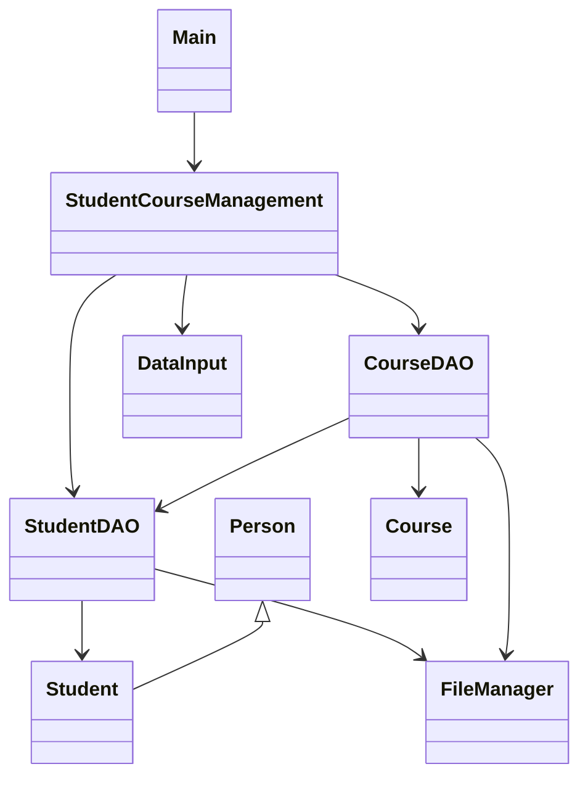
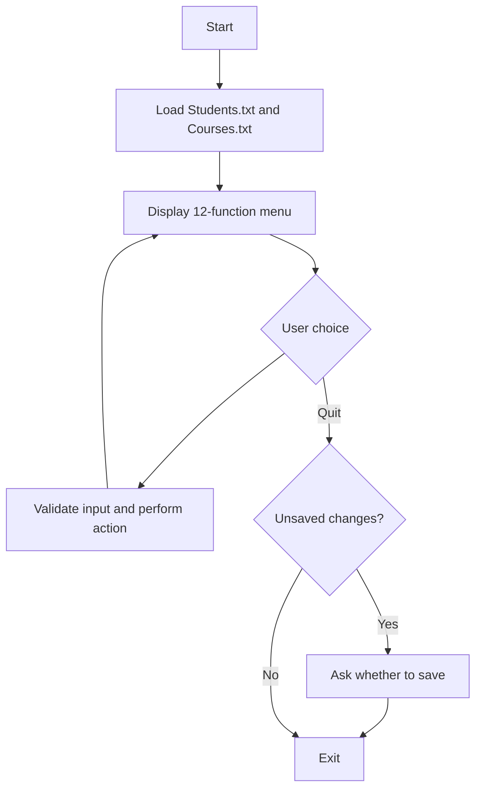

# Design

## Class diagram

```mermaid
classDiagram
    Main --> StudentCourseManagement
    StudentCourseManagement --> StudentDAO
    StudentCourseManagement --> CourseDAO
    StudentCourseManagement --> DataInput
    StudentDAO --> Student
    Person <|-- Student
    CourseDAO --> Course
    StudentDAO --> FileManager
    CourseDAO --> FileManager
    CourseDAO --> StudentDAO
```

## Main flow

```mermaid
flowchart TD
    Start --> Load[Load Students.txt and Courses.txt]
    Load --> Menu[Display 12-function menu]
    Menu --> Choice{User choice}
    Choice --> Action[Validate input and perform action]
    Action --> Menu
    Choice -->|Quit| Dirty{Unsaved changes?}
    Dirty -->|Yes| Ask[Ask whether to save]
    Ask --> Exit
    Dirty -->|No| Exit
```
