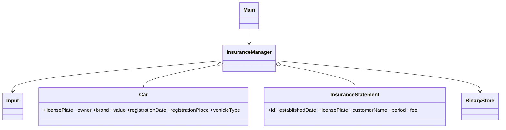
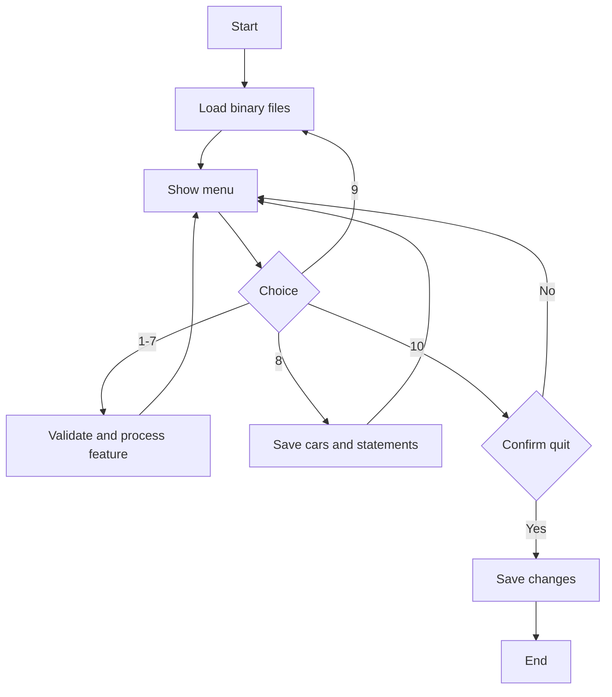

# Class Diagram

```mermaid
classDiagram
    Main --> InsuranceManager
    InsuranceManager --> Input
    InsuranceManager o-- Car
    InsuranceManager o-- InsuranceStatement
    InsuranceManager --> BinaryStore
    class Car { +licensePlate +owner +brand +value +registrationDate +registrationPlace +vehicleType }
    class InsuranceStatement { +id +establishedDate +licensePlate +customerName +period +fee }
```

# Program Flowchart

```mermaid
flowchart TD
    A[Start] --> B[Load binary files]
    B --> C[Show menu]
    C --> D{Choice}
    D -->|1-7| E[Validate and process feature]
    D -->|8| F[Save cars and statements]
    D -->|9| B
    E --> C
    F --> C
    D -->|10| G{Confirm quit}
    G -->|No| C
    G -->|Yes| H[Save changes]
    H --> I[End]
```
