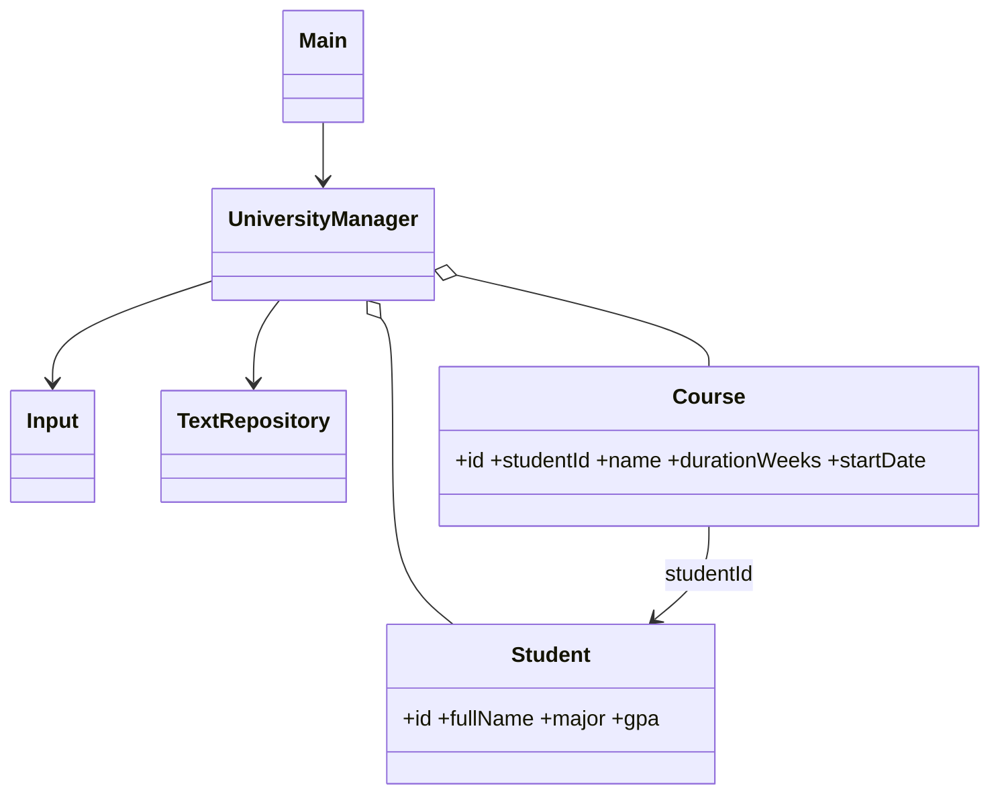
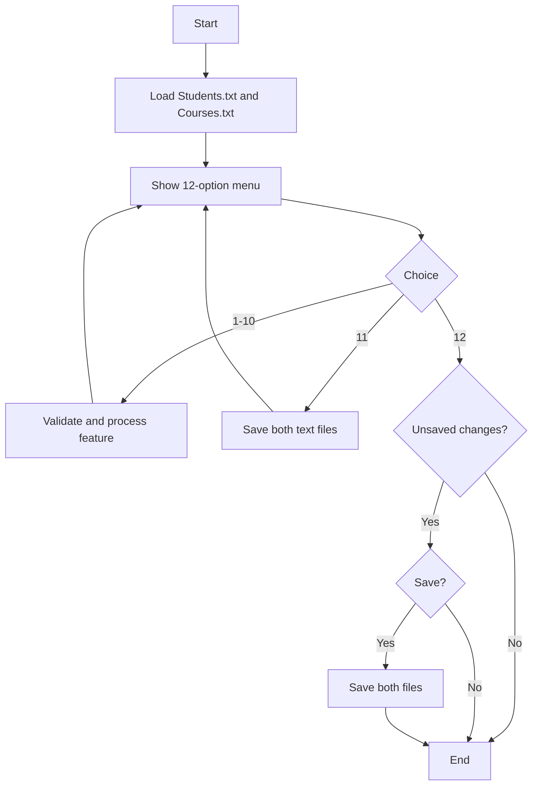

# Class Diagram

```mermaid
classDiagram
    Main --> UniversityManager
    UniversityManager --> Input
    UniversityManager --> TextRepository
    UniversityManager o-- Student
    UniversityManager o-- Course
    Course --> Student : studentId
    class Student { +id +fullName +major +gpa }
    class Course { +id +studentId +name +durationWeeks +startDate }
```

# Program Flowchart

```mermaid
flowchart TD
    A[Start] --> B[Load Students.txt and Courses.txt]
    B --> C[Show 12-option menu]
    C --> D{Choice}
    D -->|1-10| E[Validate and process feature]
    E --> C
    D -->|11| F[Save both text files]
    F --> C
    D -->|12| G{Unsaved changes?}
    G -->|No| I[End]
    G -->|Yes| H{Save?}
    H -->|Yes| F2[Save both files]
    H -->|No| I
    F2 --> I
```
